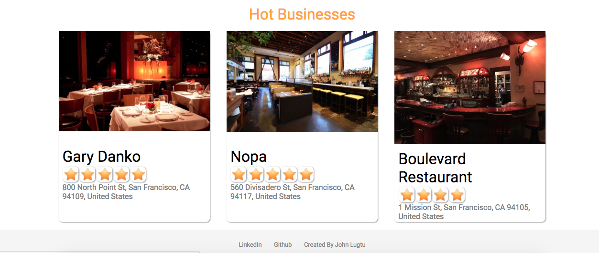
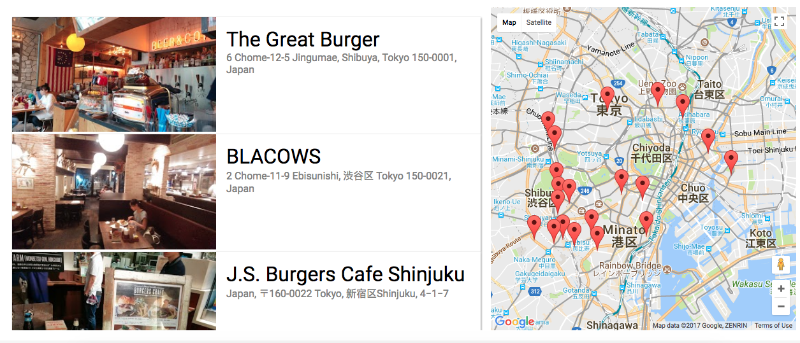

# Hoot


[__Hoot__](https://hoots.herokuapp.com/), a Yelp clone, is an application which helps people find great local businesses and places where users can rate and write reviews based on their experiences. It utilizes `Ruby on Rails, React/Redux, PostgreSQL, Google Places API, and Google Maps API`.



## Features
  + Cross-Platform Compatibility
    + Utilizing responsive design and CSS3, the application is both mobile and desktop compatible.
  + Business
    + Using `Google Places API`, the app is populated with data of actual businesses and locations.
  + Reviews
    + Allows users to rate and review each location based on their experiences.
  + Search
    + Searches places across the world depending on a user's criteria.
  + Map
    + Renders markers of locations with `Google Maps API`.

## Cross-Platform Compatiblity


  
Utilzing responsive design Hoot is usable for mobile, tablet and desktop. All components are easily scaled to the proper devices using CSS3(media-queries and grid layouts).

## Business Page


  Populated with `Googles Places API` which renders all the information into the components. The data displayed are current and real time information of the businesses.

```
def show
  place_id = params[:id]
  url = "https://maps.googleapis.com/maps/api/place/details/json?"
  response = RestClient.get url, {params: {
                                    key: ENV["google_api_key"],
                                    placeid: place_id }}
  response = JSON.parse(response)

  if response["status"] == "INVALID_REQUEST"
    render json: ["Invalid Request"], status: 404
  else
    @business = response["result"]
    ratings = Review.where('place_id' =>            @business["place_id"]).average(:ratings)
    @business["ratings"] = if ratings.nil? then 5 else ratings.to_f end
    render '/api/businesses/show'
  end
end
```
Hoot is using a server-side http call to retrieve information of a business then serving it to the React frontend while following a redux cycle.

## Maps And Search


### Google Places API Integration

  The backend is using server side http to retrieve the information with regards to the search params, then served to the frontend to be displayed in an index component. Hoot gives the accessibility to it's users to make searches for any locations of their interest. New places are right around the corner to be discovered.



## Google Maps API Integration

  As the backend retrieve and serve data to the frontend, Hoot places and renders markers onto the map to be displayed to it's users.

```
updateMarkers(businesses) {
  const bizArray = Object.values(businesses);

  for(let biz in bizArray) {

    if(!this.markers[bizArray[biz].place_id]) {
      this.markers[bizArray[biz].place_id] = new google.maps.Marker({
        position: bizArray[biz].location,
        title: bizArray[biz].name,
        animation: google.maps.Animation.DROP
      });

      this.addInfoWindow(bizArray[biz], this.markers[bizArray[biz].place_id]);
    }
  }

  this.moveToLocation(bizArray[0].location);
  this.drop();
}
```

## Future Direction of The Project
  + Future Features
    + User Profile
    + Followers
    + Include images to review
    + Allow users to add images to business pages.
  + Changes
    + Move Sign Up and  Login Pages to Modals
